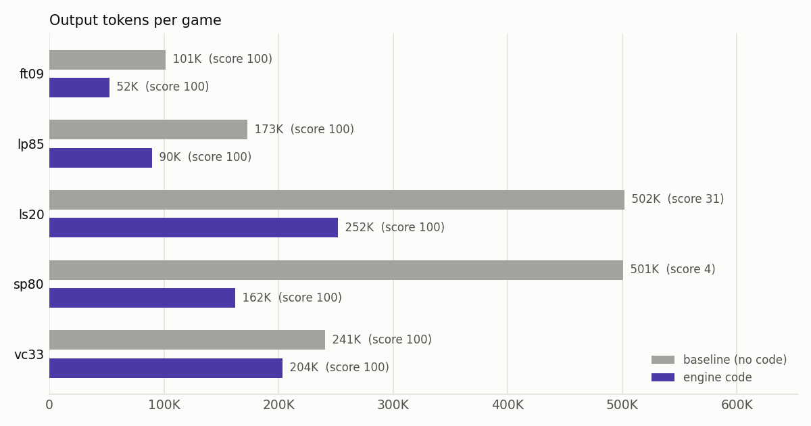
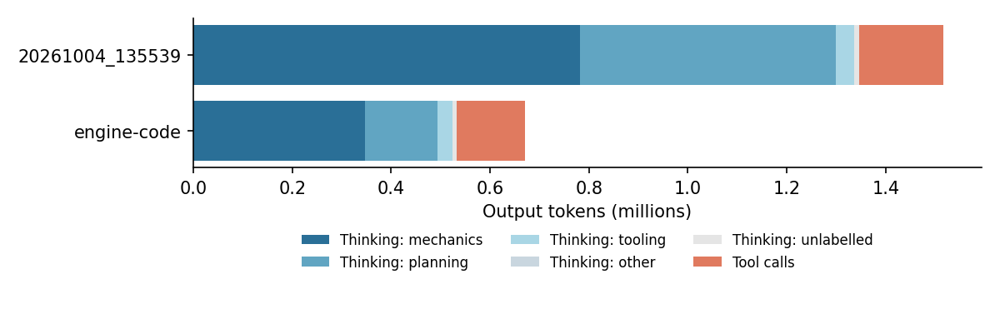

# Experiment: let the agent read the game's code

Run `runs/20261004_135539` again with one change: the agent can read the source
code of the game it plays. Compare scores, token spend and cost, output split
into thinking and tool calls, and what the thinking is about.

**Result, one sample each:** every game was won and the mean score rose from
66.94 to 100. Output tokens halved, cost fell 40% and wall-clock time fell 60%.
The thinking that shrank most was working out the rules from the screen, which
fell from 764K to 183K tokens, and planning, which fell from 524K to 159K. The
agent spent 217K tokens of thinking on the code instead.

## Setup

| | Baseline | Engine code |
| --- | --- | --- |
| Run | `runs/20261004_135539` (DVC) | `runs/engine-code` (DVC) |
| Settings | `params.yaml` | `params.yaml` + `ARC3_GAME_CODE_DIR=game_code` |
| Model | qwen/qwen3.8-flash, served by Alibaba for every request | same |
| Games | ls20, ft09, vc33, sp80, lp85; 1 pass; 500K output tokens and 240 min per game | same |

- **What the agent can read.** `game_code/` holds each game's module, copied
  byte for byte from the file the game loader runs (sha256 in
  `game_code/manifest.json`), and the `arcengine` package the games import. The
  python tool gets `game_code_files`, `game_code(file)` (full text) and
  `read_game_code(start, end, file)` (numbered lines). The system prompt
  describes them, maps color numbers to the ASCII characters, and names the
  camera that maps game coordinates to the 64x64 frame. The agent can read the
  code, not run it.
- **The code is obfuscated** (names like `cgj()`, `qroguobpp`), and most of each
  module is sprite pixel tables. lp85 is 21,451 lines, so the agent has to
  search it rather than read it all.
- **Nothing else changed in the agent.** Between the two runs the harness only
  gained resume support and per-game log names. The baseline's uncommitted fix
  in `openai_compat.py` (in its `git_info.txt`) is the one committed since.

## Results

| Game | Score | Levels | Actions | Output tokens | Thinking share | Input tokens | Cost | Game time |
| --- | ---: | ---: | ---: | ---: | ---: | ---: | ---: | ---: |
| ft09 | 100 → 100 | 6/6 → 6/6 | 100 → 75 | 101K → 52K | 82% → 78% | 3.7M → 2.4M | $0.13 → $0.08 | 31 → 11 min |
| lp85 | 100 → 100 | 8/8 → 8/8 | 119 → 96 | 173K → 90K | 82% → 68% | 6.5M → 6.6M | $0.24 → $0.18 | 45 → 20 min |
| ls20 | 31.0 → 100 | 5/7 → 7/7 | 866 → 466 | 502K → 252K | 89% → 71% | 24.2M → 15.1M | $0.82 → $0.46 | 170 → 68 min |
| sp80 | 3.7 → 100 | 1/6 → 6/6 | 111 → 143 | 501K → 162K | 91% → 89% | 13.0M → 5.5M | $0.59 → $0.22 | 117 → 34 min |
| vc33 | 100 → 100 | 7/7 → 7/7 | 331 → 183 | 241K → 204K | 91% → 82% | 8.1M → 9.9M | $0.32 → $0.33 | 67 → 46 min |
| **All** | **66.9 → 100** | **27/34 → 34/34** | **1,527 → 963** | **1.52M → 0.76M** | **89% → 78%** | **55.5M → 39.6M** | **$2.10 → $1.26** | **2h50 → 1h08 run** |



- **The two games the baseline could not finish were won.** In the baseline, ls20
  and sp80 stopped at the 500K output-token limit on levels they could not solve
  (ls20 level 6, sp80 level 2). With the code, both were won in about half and a
  third of that budget.
- **The three games both runs won got cheaper.** The baseline already scored the
  maximum 100 on ft09, lp85 and vc33, so their score could not rise. Their
  output fell from 515K to 345K tokens (-33%) and their cost from $0.69 to
  $0.58 (-16%). vc33 alone cost about the same: its input grew, from code kept
  in context.
- **Fewer actions.** 27 levels were solved in both runs. On those, the
  engine-code run used 599 actions against 1,113, and fewer on 24 of the 27
  levels. Human baseline: 1,480. Output tokens on those levels: 466K against
  844K.
- **Level 1 costs more, later levels less.** Before its first action the agent
  spends 12 to 25 responses (9K to 31K output tokens) reading the code. Level 1
  output across the 5 games rose from 74K to 90K tokens, and all later levels
  together fell from 1.44M to 0.67M.

## Tokens and cost

| | Baseline | Engine code | Change |
| --- | ---: | ---: | ---: |
| Model responses | 729 | 548 | -25% |
| Input (prompt) tokens | 55.5M | 39.6M | -29% |
| … served from the provider's cache | 92.5% | 94.5% | |
| … code text kept in context (estimate) | | 12.4M (31%) | |
| Output tokens | 1,517K | 760K | -50% |
| … thinking | 1,347K (89%) | 593K (78%) | -56% |
| … tool calls (Python written) | 170K (11%) | 167K (22%) | -2% |
| … … of which calls that read code | | 64K | |
| Cost (billed) | $2.10 | $1.26 | -40% |
| … upstream cost of input | $1.45 | $0.92 | -36% |
| … upstream cost of output | $0.71 | $0.36 | -50% |



- **Thinking fell; tool-call code did not.** Thinking fell by 754K tokens. Tool-call
  code stayed at about 170K, but 38% of it is now calls that read code: 279
  calls that printed 557K characters of source.
- **Reading code costs input more than output.** The code the agent printed stays
  in the conversation and is re-sent with every request until the history is
  trimmed. An estimated 12.4M input tokens, 31% of the run's input, were code
  text. The prompt cache serves most of it (94.5% cached), so input still costs
  less than the baseline's, because there are fewer requests.
- **Output is still the smaller part of the bill.** Input is 72% of the
  provider's upstream cost, against 67% in the baseline. (OpenRouter reports the
  upstream split; it sums to slightly more than the billed cost.)

## What the thinking is about

Each response's thinking is cut into excerpts of about 600 characters (6,956 in
the baseline, 3,180 with engine code). Claude Haiku 4.5 labels each excerpt with
a topic, and whether it discusses the game's source code. An excerpt counts its
response's reasoning tokens in proportion to its length. Both runs were labelled
the same way, so they compare directly. These shares differ from the baseline's
earlier analysis (65% / 29% / 6%), which another labeller made.

| Thinking tokens | Baseline | | Engine code | | Change |
| --- | ---: | ---: | ---: | ---: | ---: |
| Mechanics: working out the rules | 785K | 58% | 400K | 67% | -49% |
| … from observing the game | 764K | 57% | 183K | 31% | -76% |
| … from the source code | 21K | 2% | 217K | 37% | |
| Planning: choosing and checking moves | 524K | 39% | 159K | 27% | -70% |
| Other: own Python and tooling | 37K | 3% | 33K | 6% | -11% |
| Other: rest | 1K | 0% | 0K | 0% | |
| **All thinking** | **1,347K** | | **593K** | | **-56%** |

- **Mechanics still dominates, but now comes from the code.** The share of mechanics
  rose from 58% to 67%, but in tokens it halved. Most of it now discusses the
  source: the agent reads the win condition and the effect of each action, then
  checks them against the screen. Inferring the rules from observation fell by
  three quarters. The baseline's 2% "from the source code" is the labeller's
  false-positive rate; that run had no code.
- **Planning fell the most, by 70%.** With the rules and the level layouts known,
  the agent often writes a search over the level data instead of reasoning
  move by move. One lp85 excerpt: "Let me write a general solver that reads
  level data from the source: parse Level sprites list ... Then BFS".
- **The code keeps being read after level 1.** Code-reading calls per game: ls20
  100, vc33 78, lp85 42, ft09 30, sp80 29. Later levels add mechanics, and the
  agent goes back to the code for them: ls20 level 6 has 41 such calls. The
  share of thinking about source code is highest on level 1 (54% to 86%) and
  stays between 0% and 73% on later levels.

| Game | Mechanics | Planning | Tooling and other | About source code | Code-reading calls | Code printed (chars) | Code in context (est.) |
| --- | ---: | ---: | ---: | ---: | ---: | ---: | ---: |
| ft09 | 80% → 76% | 17% → 20% | 3% → 4% | 5% → 64% | 30 | 55,435 | 1.0M of 2.4M |
| lp85 | 78% → 65% | 19% → 25% | 2% → 10% | 2% → 38% | 42 | 69,427 | 2.0M of 6.6M |
| ls20 | 54% → 73% | 41% → 21% | 5% → 6% | 2% → 43% | 100 | 172,520 | 4.2M of 15.1M |
| sp80 | 49% → 53% | 49% → 42% | 1% → 5% | 1% → 27% | 29 | 87,799 | 1.6M of 5.5M |
| vc33 | 66% → 73% | 33% → 22% | 1% → 5% | 2% → 43% | 78 | 171,419 | 3.7M of 9.9M |

Per-level figures are in `levels.csv`.

## How far to trust it

- **One sample per arm.** The model samples at temperature 0.7, so a single run
  per game cannot separate the effect from luck on any one game. The direction
  is consistent, though: fewer tokens on 20 of the 27 levels both runs solved,
  and two unsolved games went to 100. A second sample of each arm would bound
  the variance. A no-access control was started alongside, then stopped when the
  baseline's data could be pulled from DVC. Its partial data is not used
  here and not archived.
- **The score is capped.** Each game scores at most 100, and the baseline already
  had 100 on three games. Actions are the better measure of efficiency there.
- **Topic labels.** On the baseline's 54 hand-labelled chunks, this labeller
  matches the hand labels on 87% of chunks; the earlier analysis's subagent
  labels match them on 74% (`check_labeller.py`). With the same excerpts and batches it gives the same
  labels: a full relabel of the baseline matched on all 6,903. The line between
  mechanics and planning is fuzzy on excerpts that do both.
- **Code in context is an estimate.** Per request, it is the prompt tokens times
  the share of the request's text characters that are code printed by the
  agent. Images also take prompt tokens, so this overstates it somewhat.
- **This tests knowledge of the rules, not a competition setting.** In the
  competition the agent does not see the game's code. The result measures how
  much of the cost is working out the rules: about half the output.

## Reproduce

Both runs are in DVC. The bucket allows anonymous reads: without AWS
credentials, set `dvc remote modify --local storage allow_anonymous_login true`
first. From `ARC3-Inference/`:

```bash
dvc pull runs/20261004_135539.dvc runs/engine-code.dvc
uv run --no-sync python scripts/token_breakdown.py runs/20261004_135539 runs/engine-code \
  --out experiments/engine-code-access --names "baseline (no code),engine code"
```

The engine-code run's request logs were compressed with xz after the run
(`*_requests.jsonl.xz`, 1.4 MB instead of 283 MB); its `response` lines still
repeat the request, as logs did before that change.

To play the engine-code arm again, with `OPENROUTER_API_KEY` set:

```bash
uv run --no-sync python scripts/extract_game_code.py ls20 ft09 vc33 sp80 lp85
uv run --no-sync python scripts/dvc_eval.py --run-dir runs/engine-code \
  --metrics runs/engine-code.metrics.json --env ARC3_GAME_CODE_DIR=game_code
uv run --no-sync python scripts/token_breakdown.py runs/20261004_135539 runs/engine-code \
  --out experiments/engine-code-access --label --names "baseline (no code),engine code"
```

The game run took 68 minutes and cost $1.26. Labelling cost $2.32 for the
baseline and $1.04 for the engine-code run; with `labels/` present, the last
command calls no model.

## Files

| File | Contents |
| --- | --- |
| `games.csv`, `levels.csv`, `responses.csv` | Tokens, cost, actions, scores and thinking topics per game, per level, per model response |
| `summary.json` | Totals per run and per game |
| `tokens.png`, `tokens_by_game.png` | The two charts above |
| `labels/*.jsonl` | Topic label of every thinking excerpt (the labelling cache) |
| `check_labeller.py`, `labeller_check.json` | The labeller check against the baseline's hand labels |
