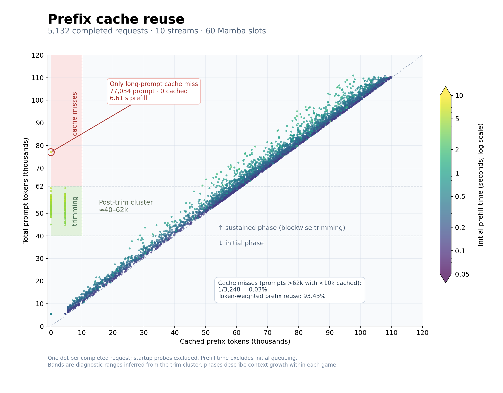
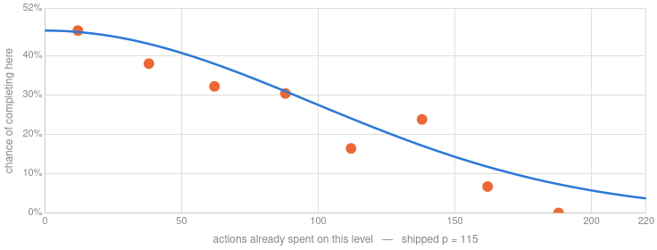
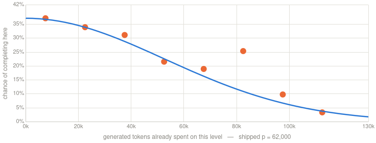

# ARC-AGI-3 Milestone 2: Building on the Duck Harness

*Daniel Franzen*

My [open-sourced notebook](https://www.kaggle.com/code/dfranzen/arc-agi-3-milestone-2-solution) scored **27.89** on the public ARC-AGI-3 competition leaderboard. This write-up describes my submission and the changes I implemented.

The starting point of my journey was [Tufa Labs’ Duck harness](https://github.com/Tufalabs/duck-harness), which they published for the first milestone prize in this competition. Full credit goes to **Jeroen Cottaar and Tufa Labs** for the original solver, harness, and notebook. Their [June milestone notebook](https://www.kaggle.com/code/jeroencottaar/tufa-labs-duck-harness-june-30-milestone-winner) and [technical write-up](https://www.kaggle.com/competitions/arc-prize-2026-arc-agi-3/discussion/717133) explain the underlying approach.

**I kept their core idea**: a language model plays the games through a Python tool, using code to inspect the board, test mechanics, and execute actions. My work focused on making that loop more efficient under the competition’s strict hardware limits. This meant improving how much useful computation the model could do in limited time, as well as improving the information it can access to make better decisions.

This source repository contains the modified harness and my [SGLang builder and patches](serving/README.md). The [configuration guide](ARC3-Inference/CONFIGURATION.md) documents the individual features, including experiments that were not enabled in this submission.

**TL;DR** — the most impactful changes and findings:

- **Better models help a lot.** During the competition, I switched from [Qwen3.6-27B](https://huggingface.co/Qwen/Qwen3.6-27B-FP8) to [Qwen3.8-27B](https://huggingface.co/Qwen/Qwen3.8-27B-FP8), and finally to [Qwen3.8-Flash-Next](https://huggingface.co/Qwen/Qwen3.8-Flash-Next). Each switch brought a substantial improvement.
- **Exposing animations.** Some games play animations which contain important information. Giving the model access to the intermediate frames helped it understand and solve those games.
- **Improving perception.** Increasing the image scale from 4× to 10×, adding difference images that highlight changed pixels, and showing the board state after game over helped the model to better understand the games.
- **Adding new ways to act.** Making the UNDO action available helped substantially in my competition runs.
- **Preventing wasted actions.** Guards stop further actions in a Python snippet after an action leaves the interior board unchanged.
- **Retaining useful information and code.** Larger context helped with more difficult games and levels. With the increased context, completely turning off the original text-based world model mechanism worked best in my tests. Retaining Python functions written by the model lets it reuse helpers across calls and levels, preventing unnecessary token generation.
- **Maximizing token throughput.** With scores still improving near the end of runs, increasing token throughput remained a promising way to improve the score. This led to testing different model quantizations and improving prefix caching.
- **Re-distributing computation between games.** Equal allocation spends many tokens on games that show little progress. I added a scheduler that directs more work towards games where current progress looks promising.

In the following sections, I'll give a thorough explanation of the changes and discoveries I made during the competition.

## 1. Model and serving

I began my experiments with the original Duck harness using the [Qwen3.6-27B](https://huggingface.co/Qwen/Qwen3.6-27B-FP8) model. Later, I switched to its successor [Qwen3.8-27B](https://huggingface.co/Qwen/Qwen3.8-27B-FP8), and then to the larger [Qwen3.8-Flash-Next](https://huggingface.co/Qwen/Qwen3.8-Flash-Next). Each model switch gave a substantial improvement in my experiments, and the latest switch got me to first place on the leaderboard for a short moment on September 6th, 2026, but I was quickly overtaken by Tufa Labs.

Fitting Qwen3.8-Flash-Next on the RTX PRO 6000 requires offloading its large PLE embedding table to host RAM. I initially used [RadixArk's NVFP4 quantization](https://huggingface.co/RadixArk/Qwen3.8-Flash-Next-NVFP4), then switched shortly before the deadline to [Intel's W4A16 AutoRound quantization](https://huggingface.co/Intel/Qwen3.8-Flash-Next-W4A16-AutoRound). In my tests, it provided similar quality and throughput, while leaving more VRAM available for the KV cache.

The open-sourced submission uses a separate quantized MTP draft checkpoint from [Albucino](https://huggingface.co/albucino/Qwen3.8-Flash-Next-W4A16-FP8PLE) for speculative decoding. I chose to retain the main model's unquantized BF16 PLE table, as the competition machine has enough system memory to comfortably fit it. (For machines with less system RAM, Albucino’s version is an alternative with an FP8 PLE table.)

Inference runs on [Pennyroyal, John Pezzulli's SGLang fork](https://github.com/jpezzulli/sglang-rtxpro6000), release v2.5.3 at commit `d00d88e`. The build used in the notebook includes a few additional patches:

- **Low-M BF16 GEMM support**, adapted from [Gabriel Olympie’s patch 0004](https://github.com/gabrielolympie/sglang-flashnext-sm120/blob/main/patches/0004-sm120-lowm-triton-gemm.patch), for faster matrix multiplications at small batch sizes.
- **A speculative-state memory-budget correction**, adapted from the budget-accounting changes in [patch 0002 in Mamy Ratsimbazafy’s repository](https://github.com/mratsim/sglang-qwen38fn-sm120-turbo/blob/master/patches/0002-sm120-gdn-recover-ssm.patch). This avoids reserving memory for buffers that are not actually allocated.
- **A Marlin scale-dtype fix**, included in my [build script](serving/build_bundle_pennyroyal.sh), to resolve a BF16/FP16 mismatch when loading the quantized model.
- **My prefix-cache patch**, included in the same [build script](serving/build_bundle_pennyroyal.sh), described below, to retain useful Mamba checkpoints and refresh their LRU position before releasing them.
- **My checkpoint-prefetch patch**, also included in the [build script](serving/build_bundle_pennyroyal.sh), to read shards in the loader’s order with parallel readers and keep prefetching one shard ahead. The submission used this together with an external background prefetcher.

The model was also resharded to make loading more practical. A single very large shard made it difficult to keep prefetching aligned with the loader's access pattern. Smaller shards and a background prefetcher made startup much more reliable. These are storage-layout changes; the model's weights remain unchanged.

The important settings for the open-sourced submission were:

| Setting | Value |
| --- | --- |
| GPU | Single RTX PRO 6000 |
| Parallel streams | 10 |
| Harness context window | 131,072 tokens (128 Ki) |
| Maximum generated output per request | 12,288 tokens (12 Ki) |
| Server context limit | 139,264 tokens (136 Ki) |
| Configured context drain | 59,392 tokens (58 Ki) |
| KV-cache dtype | FP8 E4M3 |
| Mamba cache capacity | 60 slots |
| Static memory fraction | 0.96 |
| Chunked prefill | 8,192 tokens |
| Speculative steps | 3 |
| Sampling parameters | Temperature 0.7, top-p 0.95, top-k 20 |

I reached Kaggle's compute limit before I could do a full demo run with the final submission configuration. I plan to run it on the demo set next week and update this write-up with the results.

## 2. Increasing context size

Giving the model more retained context helped especially with the more difficult games and levels, but only when the serving stack could reuse it efficiently. Otherwise, reprocessing a long history on every request would consume a large part of the available runtime.

The Duck harness maintains a system prompt followed by a growing interaction history. User prompts, the model's thinking and assistant responses, as well as tool calls and outputs, are appended to that history. (Side note: the choice to retain the model's thinking output is deliberate and already present in the original harness - removing it leads to a large regression in score.) When history grows too large to fit the context limit, trimming happens at the beginning of the history (right after the system prompt). This changes the content right after the system prompt, so most of the old prefix can no longer be reused. Solving this problem required various modifications, explained in detail in the following.

### Estimating the actual input size

The original character-based estimate used a fixed conversion factor between characters and tokens, and also counted serialized image data, including base64 PNG strings, as if it were text. That is a poor proxy for the actual token usage of the images.

The modified harness estimates text separately and calibrates its conversion factor against usage reported by the backend. Image tokens are estimated from image dimensions and the model's patch/merge layout. This made the trimming decisions much more closely reflect the actual context budget.

### Limiting concurrent admission to protect the cache

When a request finishes, it usually leaves for a tool call (which usually takes no longer than a second), and then returns to continue generation. Starting more games than the backend can keep resident in its KV cache or Mamba states creates cache pressure: a game returning would be queued, and when finally admitted, might find its prefix evicted from the KV cache by other games that took its spot in between.

To prevent this, I limited admission to ten game streams, matching the server's request limit, to keep their cached prefixes resident and reusable when they return. The remaining games wait at the harness side (either by the concurrency limit, or the priority gate mechanism if priority scheduling is enabled).

### Retaining only useful Mamba checkpoints

Flash-Next needs both attention KV state and the relevant recurrent-state checkpoints for prefix reuse. Having enough KV capacity alone did not guarantee a cache hit.

The cache patch reduces checkpoint proliferation during prefill, which has no use in our case, as we never reduce context from the end. To reduce cache pressure, it keeps only the final prefill checkpoint, instead of filling the state cache with intermediate checkpoints. A limited branch checkpoint for a cold-start path is also retained to allow restarting from the end of the system prompt. Additionally, the end-of-prefill checkpoint's LRU position is refreshed when its decode part finishes.

Keeping the end-of-prefill checkpoint matters even though a decode-end checkpoint is also created: due to re-tokenization, the tokenized conversation might not exactly match the generated token sequence from before. Retaining the final prefill checkpoint therefore guarantees a reusable state to be added to the cache.

### Trimming in larger blocks

If the harness drops just enough history to fit the next request, it soon reaches the limit again. Each small trim changes the prefix and causes another expensive prefill.

**I added hysteresis**: once the context exceeds its budget, a larger block is discarded. The history then has room to grow for many requests while its prefix remains reusable.

In the open-sourced submission, the harness uses a **maximum context length of 128 Ki**, of which it reserves **12 Ki tokens for output**. When the input approaches its limit, it trims a larger block of history, targeting roughly **57 Ki of retained context**. This trades some retained history at each trim for much less repeated prefill work.

*Prefix reuse in an earlier demo run, with a slightly different config (120 Ki harness context window, 52 Ki drain, a static memory fraction of 0.955, and a constant priority tail B=5). Points near the diagonal reuse nearly the entire prompt. The low-cache cluster around 40–62k is consistent with re-prefilling after trimming in this earlier configuration; only 1 of 3,248 requests longer than 62k had fewer than 10k cached tokens. Across all 5,132 completed game requests, **93.43% of prompt tokens were reused** from cache.*

The table below summarizes cache reuse and serving performance measured during that earlier demo run; these are not measurements of the final submission configuration (though I would expect them to be roughly similar):

| Metric | Earlier demo run |
|---|---:|
| Prefix caching fraction, weighted by tokens | 93.43% |
| P90 effective prefill throughput | 10,552.6 tokens/s |
| P90 aggregate decode throughput | 836.6 tokens/s |
| Harness-side generation throughput | 609.0 tokens/s |
| Prefill time fraction¹ | 15.25% |
| Long-prompt cache miss rate² | 0.03% (1/3,248) |

¹ Fraction of wall-clock time covered by initial-prefill intervals, with overlaps counted once; not exact GPU utilization.

² Fraction of prompts longer than 62k tokens which have fewer than 10k cached tokens.

## 3. Allocate computation where it can still help

An equal time limit per game wastes computation and opportunities. Some games finish early; others use a great deal of computation without reaching the next level. Meanwhile, a game making progress may benefit from more time.

To achieve this, all game sessions are now started simultaneously (instead of limiting whole-game execution to a fixed number of concurrent games), and **a scheduler limits the concurrent admission to ten active games**, while the other games wait in the background, with their state frozen. This mainly provides two advantages over a fixed-time budget per game:

- The **ten available slots are kept occupied** while enough unfinished games remain (except during short interruptions for tool calls). If some of the games finish early, their remaining budget is automatically redistributed to other games.
- It allows **computation to be redistributed** specifically towards promising games by preferring them in the scheduling algorithm.

In the open-sourced submission, the scheduling algorithm admits a game with the **highest current priority $P$**, calculated as:

$$
P = (A+B) \cdot C
$$

$$
A = \ell\cdot\left(\frac{25}{25+a}\right)^2\cdot\frac{55}{N(N+1)/2}
$$

$$
C = 0.25\cdot 2^{-(a/115)^2} + 0.75\cdot 2^{-(t/62000)^2}
$$

Here, $\ell$ is the current level number, $a$ is the number of actions spent on that level, and $t$ is the number of generated tokens spent on it. $N$ is the total number of levels reported by the game metadata, clipped to 6–10, with a fallback of 10 if unavailable or invalid.

**A approximates the immediate score gain** from completing the current level, with an action-efficiency penalty similar to that in the official scoring formula. The factor $55 / (N(N+1)/2)$ accounts for games having different total level counts, using a ten-level game as the reference. This normalization applies only to A.

**B represents the opportunity to make further progress** after completing the current level. It uses a simple lookup based on how many levels would remain after that completion:

| Levels remaining after the current level | B |
| --- | ---: |
| 3 or more | 8 |
| 2 | 7 |
| 1 | 5 |
| 0 | 0 |

These are heuristic continuation values, not fitted completion probabilities. They give future progress more weight early in a game and remove it entirely on the last level. B receives neither score normalization nor an additional action-efficiency multiplier; the time-based fade below still applies. **C reduces priority** as a level absorbs actions and generation without completion.

**C was calibrated from actual game progression**: 725 observed level attempts from four earlier runs, including 557 completed levels and 168 unfinished levels. We measured completion rates in windows of spend among level attempts still at risk, accounting for runs ending before observation was complete. A Gaussian-shaped falloff fit those curves better than an exponential. The following images show the measured data and the adapted curves for actions and tokens:

### Fade future value near the end

Near the deadline, a level completion has less time to lead to additional completions. During the final 20% of the scheduled runtime, **B is faded linearly** from its lookup value **towards zero**:

$$
B_{\mathrm{effective}}=B\cdot\min\left(1,\frac{r}{0.2T}\right),
$$

where $r$ is remaining time and $T$ is the scheduled total duration. A and C remain active. This gradually shifts emphasis toward maximizing score from finishing the current level, while still penalizing stalled games.

### Preserve prefix reuse while scheduling

Allowing games to be interrupted after each tool call would undermine our prefix caching improvements. Therefore, a game **normally keeps its admission slot across tool calls and resumptions. Context eviction is the natural handover point**: the prefix has already changed, so this request needs substantial prefill anyway. At this point, the game re-enters the priority queue, and the freed slot is allocated to the game with the highest priority (which can also be the same game that just entered the queue). The priority-based ranking therefore operates within a policy that strongly favors retaining useful cached computation.

## 4. Improve what the agent can observe and do

### Animations

Some ARC games play animations during actions, which are given as intermediate animation frames between the actual board states. In some of the games, this can help the model understand the mechanics better, and others might be essentially unsolvable without reading these intermediate frames (like game tn36 from the public demo set). Of all perception changes, exposing animations to the model showed the strongest benefit in my tests. 

The implementation took inspiration from [Jakob Brüggen's notebook](https://www.kaggle.com/code/jakobbrggen/taaf-anim-arc-agi-3-solver). Like his implementation, the harness exposes animations in two variants: the actual animated frames returned by the game (deduplicated), and a compact timeline that describes the animated parts in textual form. Deliberately different from his implementation is how these two are exposed to the model: while his notebook just allows printing the animated frames by calling a function, here, they are directly exposed as variables in the Python REPL, so the model can inspect, compare, and compute over them (which I also observed the model doing in practice).

Another inspiration taken from that notebook is when exactly to hint the model to look at the animation. While the last action's animation is always available to read in the REPL, a specific hint to investigate the animation is given only if the animation contains "transient pixels" - pixels that change more than once on the path from starting frame to the final frame, meaning they take on a state that is not visible in the ordinary game state images.

### Object-level changes with `frame_diff`

I added a `frame_diff()` helper that lets the model compare two board states in Python. By default, it compares the board before and after the latest action, but it can also compare frames from history. It returns a structured description of what changed: objects that moved, rotated, appeared, disappeared, changed color, or changed size, plus the number of changed cells. Unchanged objects are omitted, keeping the output compact.

This builds on the harness’s segmentation into same-color, 4-connected components. The matching is a heuristic: touching objects can merge into one component, and multiple similar objects can make correspondences ambiguous. The prompt explains these limitations so the model can use the results without treating them as guaranteed object identities.

### Board images

Various changes were made regarding the images presented to the model:

- **Game-over images.** After game over, the harness now also supplies the fatal frame, rather than showing only the restarted level. That lets the model inspect what caused failure before the evidence disappears from the current view.

- **Difference images.** User prompts after performing an action include an additional difference image highlighting pixels that changed since the previous analyzer turn, which may span several actions. These images are omitted across level boundaries and when the board is unchanged. After game over, a similar difference image compares the last alive frame with the fatal frame.

- The biggest score improvement in terms of images actually came from changing the image upscaling to a factor of **10×** (instead of the original 4×). Thanks to the changes to context length estimation, the higher token count is correctly accounted for.

### Significant prompt changes

**Clarifying repeated opener prompts**

The original harness periodically re-inserts the user prompt when the model continues reasoning or inspecting the board without taking an action. However, it can repeat the outcome of an earlier action sequence without making clear that nothing new happened. A previous game over or level completion can therefore read like a fresh event.

I changed these follow-up prompts to explicitly state when no actions were executed, and to label older outcomes as reminders. This helps the model distinguish new feedback from information it has already considered, without mistaking repeated text for another change in the game.

**Game-over guidance**

After a game over, the Tufa harness just reports a short sentence in the user prompt:

> The game is over.

That message gave the model no information about possible causes or how to continue. It was usually followed by confusion and a long analysis by the model, eventually concluding that the level was reset and it could restart it. To give the model more context, I included a detailed explanation in case of a game over.

System prompt: interpreting game-over flags

> - Flag semantics: `game_over` = this attempt FAILED (death or a limit ran out) — the level auto-resets to its initial state and completed levels are kept; it never means the run is won. `level_completed` = advanced one level. `run_complete`/`done` = the whole game is won. Deaths come either from the action itself (e.g., a hazard cell) or from a step/time budget depleting — watch for a bar at the grid border that shrinks each action, and count remaining budget into your plans.

User prompt after game over: diagnosing the failure

> GAME OVER occurred during the previous sequence. This means the attempt FAILED (it does NOT mean the run is finished). The game has already been automatically RESET: the current level restarted from its initial state and previously completed levels are kept. A game over is caused either by the specific action taken (e.g., moving onto a hazard cell) or by a step/time budget running out, which is usually indicated by a bar at the grid border that shrinks with each action. Before acting again, diagnose the cause by inspecting the board right before the death. `history[-1].action` is 'RESET', `history[-2].action` is the fatal action, `history[-2].frame` is the death frame (the board after the fatal action), and `history[-3].frame` is the board immediately before the fatal action — check what cell the fatal move targeted there, and inspect the budget bar in the death frame. BAR RULE: the bar shrinking with each action is NORMAL — a slightly shorter bar is NOT evidence of the cause of death. The budget caused the death ONLY if the bar is fully (or almost fully) depleted in the death frame (`history[-2].frame`). If it IS depleted: you must reach the goal in fewer actions, or look for a way to restore the bar (e.g., collecting an item that refills it). If the bar clearly had budget remaining: the fatal action itself caused the death (hazard or forbidden move) — do NOT retry the same path; a DIFFERENT approach must be tried. Record the diagnosed cause in your world model.

User prompt after game over: revising the plan

> Do NOT re-submit this same series of moves: the game is deterministic, so replaying the sequence that just killed you will kill you again. Change the plan BEFORE the fatal point - a different route, action, or timing. If you believe the same moves 'should' work, that belief is exactly what this death falsified; record the correction in your world model instead of retesting it.

**Level-transfer guidance**

The level-up prompt now emphasizes three ideas: mechanics from the preceding level often transfer; new elements may introduce mechanics that must be understood; and the goal may remain the same or need adapting. It also explicitly identifies the current frame as the starting state of the new level:

System addition

> - Levels usually build on mechanics learned in earlier levels, especially the most recent one. Carry forward supported knowledge as a starting hypothesis, while re-checking anything contradicted by new evidence. New levels often introduce additional mechanics, sometimes through unfamiliar board elements. These additions are often important for solving the level. The goal may remain the same but require new mechanics to reach it, or the goal itself may change.

User prompt after completing a level:

> You have completed the previous level. `current_frame` now contains the starting board of the next level; any accompanying current-grid image shows this new board. Build a new plan for this layout rather than continuing the previous level's action sequence.
>
> Start from the mechanics you established on the previous level; do not rediscover them without reason. Inspect the new board for unfamiliar elements, changed arrangements, or interactions your previous understanding does not explain. New elements often introduce mechanics needed to solve this level, so prioritize small, informative tests when their behavior is unclear.
>
> Reassess the goal: does the previous objective still apply, now requiring the new mechanics, or does the evidence suggest a different objective? Combine retained knowledge with new findings to plan for this board.

### Retaining Python functions

The Python tool starts each call with a fresh namespace. Rebuilding helpers repeatedly costs generation, so I added a retention mechanism which saves eligible model-defined functions and restores them in later tool calls. The prompt explicitly says they are the model's own earlier definitions. I experimented with different scopes of retention, and finally settled on retaining defined functions for the full game.

Note that this is function retention rather than a persistent Python process. Ordinary variables are discarded, and provided game-state globals are refreshed. Therefore, board-specific data has to be passed as arguments. Retention failures are handled defensively: losing a helper is acceptable; the model is informed about which functions have been retained.

### Adding the UNDO action

The original Duck would advertise `ACTION7` in the available-action list if available without actually allowing the model to execute it. As the action is explained in the ARC 3 documentation as "simple undo action" (and this is what it generally does in the demo games), I chose to expose it to the model simply as `UNDO` and added a short system-prompt explanation alongside the other controls.

Undo is particularly valuable when a mistaken move can make a puzzle much harder or leave it stuck. Most demo games did not benefit much. An exception was `su15`, where interacting moving objects and block merging provided a clear use case. Logs confirmed that the model executed undo repeatedly there.

On the competition set, the combination of undo, action information, level-transfer guidance, and persistent functions produced a large improvement. While that does not isolate the contribution of undo alone, I still suspect that this might be a very important mechanic on the competition set.

### Return faithful action results

Each recorded transition now retains the result of its individual action. Separately, `last_action_call_result` describes the entire latest model-issued call, including batches, skipped actions, and stop reasons. Inspection-only calls preserve that information.

Death and automatic reset are separate transitions. The reset does not overwrite the result of the model call that caused death. Together with corrections to stale follow-up feedback, this gives the model a more faithful account of what its code actually did.

Tool output was increased to an approximate 3,072-token budget. Middle truncation retains both the beginning and end of long output, helping preserve exceptions and guard messages near the end. Action echo makes executed actions visible without depending entirely on the model remembering to print them.

## 5. Stopping failed action sequences

A shrinking budget bar can make every action change the image, even if nothing useful happened. The harness therefore distinguishes whole-board changes (`board_changed`) from changes in the interior board area (`gameplay_changed`), excluding a four-cell border by default. The name `gameplay_changed` should be read with that limitation: it is a geometric test, not semantic understanding. Genuine game elements can exist near the border. The system prompt explains the distinction.

The open-sourced submission enables three guards:

- **Batch no-op guard:** stop the remaining actions in a batch after an action fails to change the interior board.
- **Stale-state guard:** after an ineffective action, block a later action call in the same snippet. The first ineffective action can return normally, allowing the model's written code to handle the unexpected outcome by itself, which it usually does, and where firing an exception would potentially block such investigation and confuse the model unnecessarily. Therefore, the guard fires only if another action call is performed after the ineffective action.
- **Terminal-state guard:** stops if a further action is performed after either a game over or level completion.

The stale-state guard starts from level 2 in this configuration. The batch guard and terminal-state guard are separate from that threshold. 

## 6. What did not clearly improve the score

Compute was limited, and individual runs varied considerably. I used repeated demo runs where feasible, but these observations are practical experiment results rather than a complete controlled ablation study.

**Structured world-model updates.** The original parsing often missed model-written updates when their formatting differed from the expected labels. That could leave stale information repeatedly reinserted into context. I tried more tolerant parsing, fewer sections, and revised instructions. The largest improvement in this area came from disabling the structured world-model mechanism entirely. With a larger rolling context, the conversation itself already retained much of the useful evidence.

**Summarization.** I tried summaries inserted into the history and summaries replacing preceding context. Neither gave a clear improvement. This remains an open question, but periodic summary generation was not used in the open-sourced submission.

**Resume prompts and yielding.** Shorter prompts, different tones, and removing some reinsertion did not produce a consistently better result. The open-sourced submission retains the ordinary resume prompt. Yielding is now triggered by generated tokens (2,048 in this configuration) rather than elapsed seconds, making it independent of backend throughput.

**Animation images and automatic timeline insertion.** Showing composite animation images did not improve results and hurt some games where access to animation information had previously helped. Automatically inserting the timeline also showed no clear gain. I kept frames and timelines available for the model to inspect when useful.

**More prescriptive verification and additional guards.** A stronger step-verification hint did not improve the measured score. Repeated-state guards, remembered no-op or fatal-action guards, and death-ledger guidance were also explored without sufficiently clear benefit to include in this configuration.

**More elaborate priority rules.** Pace adjustment and an empirical continuation lookup with normalization of both A and B did not establish a clear advantage over the constant-tail policy used in earlier runs. The open-sourced submission instead uses the simple remaining-level lookup described above and normalizes only A.

## Reproduction and further details

The [competition notebook](https://www.kaggle.com/code/dfranzen/arc-agi-3-milestone-2-solution) contains the complete harness patch and configures the model, draft checkpoint, and offline runtime. Keep its attached inputs enabled and select the RTX PRO 6000 GPU when copying it. The repository's inherited local defaults do not reproduce the submission configuration on their own.

See the [harness README](ARC3-Inference/README.md) for local usage and the [configuration guide](ARC3-Inference/CONFIGURATION.md) for the complete option reference. Exact serving arguments and environment settings are recorded in the notebook.

## Acknowledgements and resources

**AI assistance.** Most of the code for my modifications was written with Claude and ChatGPT. I directed the experiments, reviewed the changes, and selected what went into the submissions.

**Compute used for development and testing.** I ran most of my experiments directly on Kaggle. During the final phase before the milestone, I also rented approximately 150 GPU-hours on single RTX PRO 6000 instances from cloud providers to run additional experiments. This was inference and testing compute; I did not train or fine-tune the models.

**Thanks to the ARC Prize team for organizing this great competition!** I had a lot of fun participating, and I learned a lot about agent harnesses along the way. Good luck to everyone heading into the final part of the competition! I hope some of the ideas here help you improve your own solutions and move us a little further along on ARC. I’m looking forward to seeing what you come up with!

